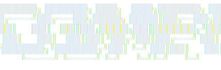

<div align="center">



### Collect compis while you code — without ever leaving your agent.

Your coding activity spawns unique ASCII creatures with randomized traits across 6 rarity tiers.
Scan to discover them. Catch the ones you want. Breed pairs to pass rare traits to the next generation. **Hundreds of millions of possible combinations.**

Works with **Claude Code** | **Cursor** | **Codex** | and more coming soon

[](https://opensource.org/licenses/MIT)
[](https://nodejs.org)
[]()

</div>

---

<div align="center">

</div>

## How It Works

```
1. Code normally        Your prompts, tool calls, and commits generate "ticks"
2. Compis spawn         Every ~30 minutes a batch of 3-5 compis appears nearby
3. Scan & catch         Run /scan to see them, /catch to grab the ones you want
4. Breed next-gen       Pair two compis to produce a child that inherits their best traits
```

Each compi belongs to one of **6 species** and is built from a handful of trait slots (typically eyes, mouth, body, tail) — each with its own rarity and unique ASCII art. Rarer traits glow in different colors, from gray commons to red mythics.

<div align="center">

</div>

## Why Compi?

- **Zero context-switching** — the game lives inside your coding agent, not a separate app
- **Your work fuels the game** — compis spawn from your actual coding activity
- **Real depth** — 6 species, 6 rarity tiers, weighted catch rates, breeding & inheritance, streaks, leveling
- **Every compi is unique** — species × trait variants × 6 colors = hundreds of millions of combos
- **Lightweight** — hooks only, no background processes, no performance impact
- **Open source** — MIT licensed, community-driven

## Installation

### Claude Code

```bash
/plugin marketplace add amit221/compi
/plugin install compi@compi
```

Then enable auto-update so you always get the latest version:
1. Type `/plugin` to open the plugin manager
2. Go to the **Marketplaces** tab
3. Select **compi**
4. Enable **auto-update**

**Optional: add a dedicated `compi` alias**

For the best experience, add a shell alias that launches a lightweight Compi-only session (Haiku model, Compi tools + file/CLI access):

```bash
alias compi='claude --model haiku --verbose --allowedTools "mcp__plugin_compi_compi__*" "Read" "Write" "Edit" "Bash"'
```

Add it to your shell profile (`~/.bashrc`, `~/.zshrc`, or `~/.profile`). **PowerShell** users — add this to your profile (`$PROFILE`) instead:

```powershell
function compi { & claude.cmd --model haiku --verbose --allowedTools "mcp__plugin_compi_compi__*" "Read" "Write" "Edit" "Bash" @args }
```

Then just run `compi` to start a dedicated session.

### Cursor

> Requires **Cursor 2.5 or later** (plugins support was added in 2.5).

Compi isn't on the official Cursor Marketplace yet, but Cursor's `/add-plugin` command can install any plugin directly from a GitHub repository. In an Agent chat, type:

```
/add-plugin compi@https://github.com/amit221/compi
```

> `/add-plugin` won't appear in autocomplete — type the full command.

Then **restart Cursor** and verify it shows up under **Settings → Plugins**.

On Cursor, Compi runs as an HTTP MCP server on `localhost:3456` (auto-started by the `sessionStart` hook) and renders output as an HTML panel via MCP Apps. The slash commands (`/scan`, `/catch`, `/collection`, …) work the same as in Claude Code.

To change the port, set `COMPI_PORT` in your environment before Cursor launches and update the `url` in `.cursor-plugin/plugin.json` to match.

## Playing

**Option 1: Dedicated Compi session** (recommended for best experience)

- **Claude Code** — run the `compi` alias you set up above to open a lightweight Haiku-powered session focused on the game.
- **Cursor** — open a new chat dedicated to Compi and use the slash commands directly. Keeping it separate from your coding chats prevents the HTML panel output from cluttering your working context.

**Option 2: Play alongside your work**

Compi runs in the background of any Claude Code or Cursor session. Compis spawn as you work — you'll see notifications and can interact with `/scan`, `/catch`, `/breed` at any time without interrupting your workflow.

## Commands

| Command | CLI | What it does |
|---------|-----|-------------|
| `/scan` | `compi scan` | Show nearby compis with traits, catch rates, and energy costs |
| `/catch [n]` | `compi catch [n]` | Catch compi #N from the current batch |
| `/collection` | `compi collection` | Browse your caught compis and their traits |
| `/breed [a] [b]` | `compi breed [a] [b]` | Pair two same-species compis to produce a child that inherits their traits |
| `/archive [id]` | `compi archive [id]` | View your archive, or move a compi into it |
| `/energy` | `compi energy` | Check your current energy level |
| `/status` | `compi status` | Player profile, stats, and progress |
| `/settings` | `compi settings` | Configure notifications and preferences |
| `/list` | `compi list` | Show all available Compi commands |

## Contributing

Compi is open source and contributions are welcome! Found a bug, have an idea for a new trait variant, or want to suggest a balance tweak? **[Open an issue](https://github.com/amit221/compi/issues/new)** — that's the best place to start a conversation before sending a PR.

<div align="center">

---

### Enjoying Compi? Help it grow.

⭐ **[Star the repo](https://github.com/amit221/compi)** so others can find it
🐦 **[Follow on X](https://x.com/AmitWagner)** for new compis and releases
💬 **[Join r/compiCli](https://reddit.com/r/compiCli)** to show off rare catches and swap merge combos

<sub>Built for the terminal. MIT licensed. No telemetry, no background processes, no bullshit.</sub>

</div>
